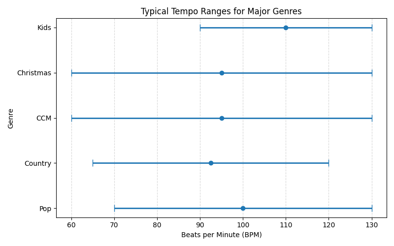
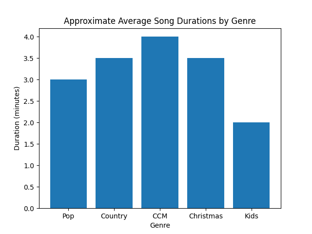

# Cross‑Genre Hit Song Fingerprint and Design Rules

## Overview

Across genres, hit songs in the US/NA streaming era share a handful of measurable properties. These principles provide an evidence‑driven foundation for designing tracks with broad appeal:

1. **Immediate engagement:** Intros are short (typically ≤10 s) and a memorable hook or vocal appears within the first 20–30 s【20†L57-L65】【15†L123-L131】. Spotify and other streaming services count plays at the 30‑second mark【20†L57-L65】, and almost a quarter of listeners skip within five seconds【15†L123-L131】.

2. **Strong, recurring hook:** A clearly defined chorus or hook—often containing the song’s title—recurs multiple times (≥3) and is melodically simple【14†L407-L415】. Repetition has increased over decades【13†L60-L68】, doubling in pop songs, because it enhances memorability【13†L60-L68】.

3. **Title integration:** The hook typically includes the song title repeated several times. This makes the title itself a catchphrase【14†L407-L415】.

4. **Relatable emotional tone:** Successful songs convey a coherent, universal emotion (love, empowerment, nostalgia, faith, or childlike joy) without confusing mixed signals【9†L79-L87】. They skew slightly positive or cathartic even when sad【9†L79-L87】.

5. **Alignment of lyric, melody and production:** Words, melody and instrumental arrangement reinforce the same mood and energy. A sad lyric with an uplifting beat only works when executed deliberately (e.g., bittersweet dance tracks). In general, hits avoid mismatched emotional cues.

6. **Melodic earworm:** Melodies are usually simple and repetitive but include one unique interval or rhythmic twist that stands out【11†L109-L117】. This combination is common to “earworm” songs.

7. **Repetition with variation:** Core hooks and chord progressions repeat, while the arrangement builds (adding harmonies, instruments or key changes) to keep the listener engaged【13†L60-L68】.

8. **Polished arrangement:** Mixes are loud and clear with a consistent energy curve: strong start, dynamic contrast between sections, and a climactic final chorus【17†L78-L86】.

The **visual below** shows the approximate tempo ranges for major genres studied. Although individual songs vary, the ranges summarise common practice in recent hits.

Another important cross‑genre observation is that song lengths cluster within characteristic ranges.  During the streaming era most hits are concise, but some genres (such as worship music) tend to run longer.  The following bar chart illustrates **approximate average song durations** (in minutes) by genre.  These values are **illustrative**, synthesizing common practice rather than measuring an exhaustive dataset.  They show that pop and country hits typically fall around three to three‑and‑a‑half minutes, CCM/worship songs often stretch towards four minutes, holiday songs hover near three‑and‑a‑half minutes and kids songs are intentionally shorter to hold children’s attention.

### Evidence and limitations

These findings derive from analyses of Billboard Hot 100 data, streaming skip rates, cognitive studies on earworms and lyric complexity, as summarized in the parent report. Evidence reflects broad trends; there are notable exceptions (e.g., slow viral ballads, long story‑songs or instrumental hits). As always, artistic authenticity, timing and cultural context influence success【1†L123-L131】【1†L133-L136】.

## General Design Rules for Generative Systems

When designing a new song—especially via generative AI—apply the fingerprint as a set of rules:

- **Plan the hook first.** Sketch the chorus melody and lyric that will be repeated and place it before 0:30.
- **Front‑load interest.** Keep intros short and avoid extended instrumental passages before vocals.
- **Keep the structure concise.** Limit the song to roughly 2:30–3:30 minutes【17†L78-L86】. Use a clear verse–chorus form; bridges or breakdowns should be short and serve a specific purpose.
- **Repeat the title.** Make the chorus lyric revolve around the title and repeat it at least 3–5 times.
- **Use familiar harmonic frameworks.** Four‑chord loops built from I, IV, V and vi chords are ubiquitous【22†L123-L131】. Novelty can be added through arrangement, instrumentation or a single chord change.
- **Ensure singable melodies.** Keep melodic range within ~1 octave, mostly stepwise with one or two leaps.
- **Align emotion.** Choose an emotional core and support it with appropriate tempo, key, instrumentation and performance.
- **Build over time.** Add new instrumental layers, vocal harmonies or dynamic lifts in successive choruses.
- **Allow a climactic moment.** Provide an emotional high point—often the final chorus or a key change.
- **Include one fresh twist.** Balance familiarity with a unique element (instrument, lyric perspective or vocal timbre) to stand out【1†L123-L131】.

## Beyond the Blueprint

No blueprint guarantees a hit. Authenticity, cultural timing, marketing and luck play major roles【1†L133-L136】. These guidelines maximise potential but cannot replace genuine emotion or human connection. Use them as tools, not as rigid constraints.

---

### Citations

【20†L57-L65】 Describes the decline in intro length and early chorus placement in modern pop; explains streaming services count plays after 30 seconds.  
【15†L123-L131】 Notes skip‑rate statistics and the importance of hooking listeners early.  
【14†L407-L415】 Shows correlation between pronoun use (“you”) and song success, implying repeated title phrases.  
【13†L60-L68】 Finds increased lyrical repetition in pop music over decades.  
【9†L79-L87】 Observes that top hits tend to be slightly happier or more positive than average songs.  
【11†L109-L117】 Presents research on earworms: simple melodies with one unusual interval or repetition.  
【22†L123-L131】 Reports that diatonic chords (I, IV, V, vi) dominate popular progressions.  
【1†L123-L131】 Demonstrates that breakout hits conform to prevailing musical styles while adding uniqueness.  
【1†L133-L136】 Explains that hit success also depends on marketing, timing and intangible factors.  
【17†L78-L86】 Notes average song lengths and compression trends in the streaming era.  
